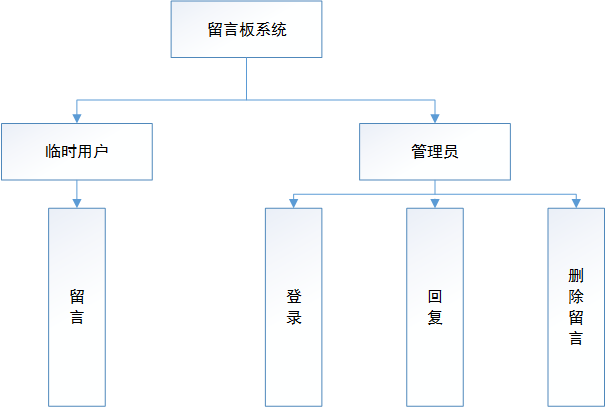
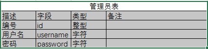
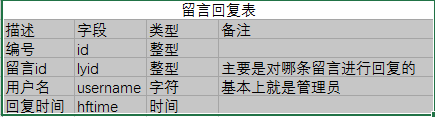
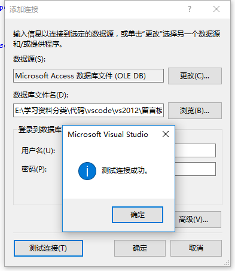
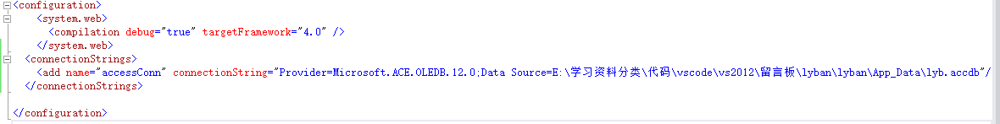

## 留言板系统说明

### 1.系统目标
用户在访问留言板网站时可以对网站进行留言，而网站管理员可以对临时用户的留言进行回复和管理。

### 2.需求分析

>1) 系统主要存在两类角色，一个是临时用户，一个是管理员。
>2) 临时用户可以在留言板进行留言。
>3) 管理员可以对临时用户的留言进行回复，删除。
>4) 临时用户识别：主要通过临时用户名，和ip地址进行识别。
>5) 管理员识别：为了简化系统，系统只存在一个管理员，需要用户名和密码，对留言板进行管理时需要进行登录。

### 3.功能分析和设计

参见如下图：



### 4.数据库设计
数据库主要有三个表，一个是留言表，一个是管理员表，还有一个是留言回复表。

>留言表：


>管理员表：



>留言回复表(少了一个留言回复内容contents字段)：



### 5.系统实施环境
系统主要在.net平台下，采用VS2012下的ASP.net开发留言表系统，数据库采用Access(07之后的版本，电脑上需要安装对应的数据库驱动程序)。具体的程序环境参考示例文件夹中的readme.txt文件。

### 6.实施方案具体步骤

* 数据库构建
1).首先需要在access数据库中将数据表设计好。
2).在vs2012中测试连接数据库，看能否成功。
3).测试连接成功后，通过代码编写操作access数据库的工具(基本上是以类文件的形式存在)。
4).测试成功之后，进行数据库操作工具的编写(主要是基于ADO.NET)。

>具体实施步骤如下：
vs数据库连接工具测试：菜单>工具>连接到数据库>。接下来选择access数据源，然后选择access数据库文件，点击测试连接。

选择高级，最下方有连接字符串，将连接字符串放在web.config文件中。

链接数据库的代码:
```CS
using System.Configuration;//可以从web.config文件中读取链接字符串
using System.Data;
using System.Data.OleDb;//这两个引用是ADO.net针对OleDb数据源的链接工具

string connString = ConfigurationManager.ConnectionStrings["accessConn"].ConnectionString;
OleDbConnection conn = new OleDbConnection(connString);
try
{
    conn.Open();
    Response.Write("success");
}
catch (Exception ee)
{
     Response.Write(ee.Message);
}
finally 
{
    conn.Close();
}
```
